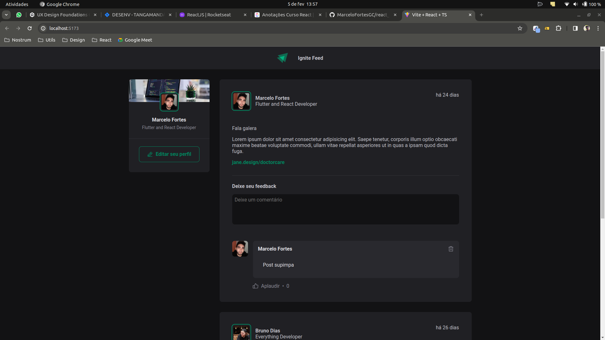

# Fundamentos ReactJs usando Vite + React + Typescript

Projeto realizado com base no curso da Rocketseat com o objetivo de realizar a introdução do ReactJS com as demais tecnologias citadas no título do projeto.
O objetivo do projeto é exemplificar o uso básico das ferramentas criando o que seria da home de uma rede social demonstrando com comentários e validação de alguns campos de comentário.

### Resultado final:

